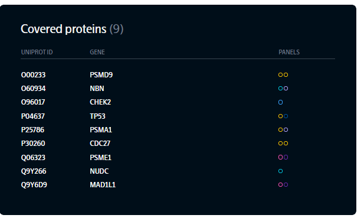

# The application

Here is the first pieces of a React application called 'protein-explorer'. The purpose is to show a list of proteins retrieved from a search request to a backend or external API.

There is a function 'fetchProteins' in 'protein-exlorer/api.js" simulating the call to the API supplying a list of proteins. There is also a function 'fetchError' simulating an error from the API call.

Make use as much of the code in the 'components' directory and 'App.js' as possible.

There is an additional readme file in 'protein-explorer' from the creation of the React application that has some useful information.

# Tasks

Do as much as you have time of the following tasks. Don't get stuck at any details. If you don't get some detail right, just move on.

You can rewrite or style the compoments as you wish.

1. implement a component "ProteinList" as close as possible to the supplied design
2. modify the React app to show the component
3. add some user interface to simulate
4. make any comments on the code you started with, what is good, bad or hard to use

# Design

The protein list should look like this at first:

When you click a row expands some detail about the protein:

Expanding another row should close the previously expanded details (max one open at a time) and the button marked with a cross should close the open detail.

_NOTE_: The font shown in the images is not publicly available. Do not make too much effort to find a replacement.
